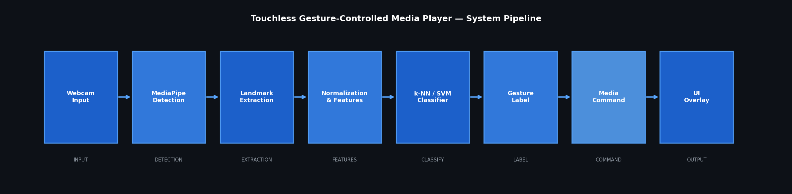
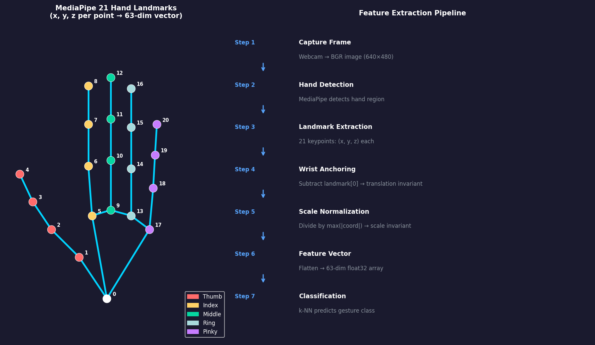
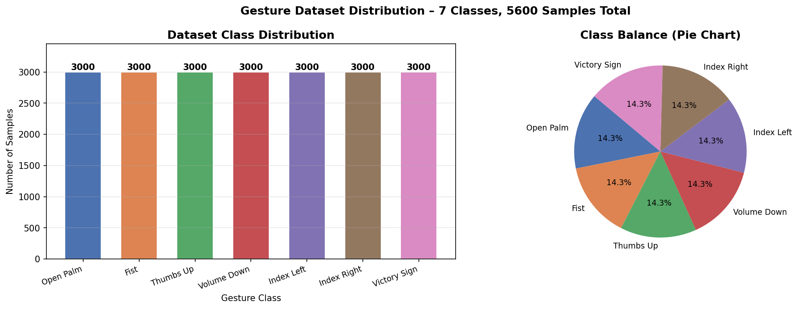
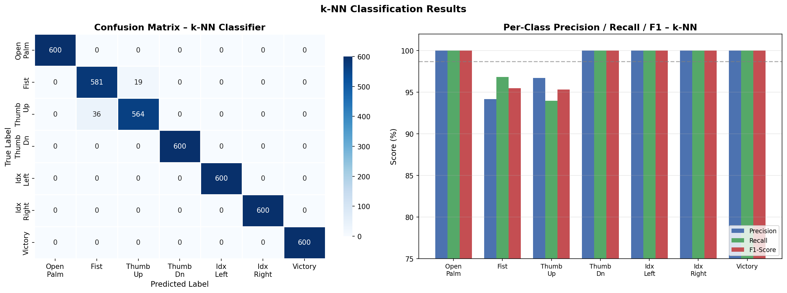
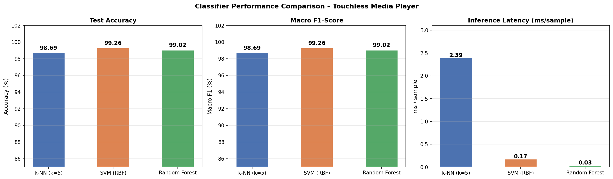
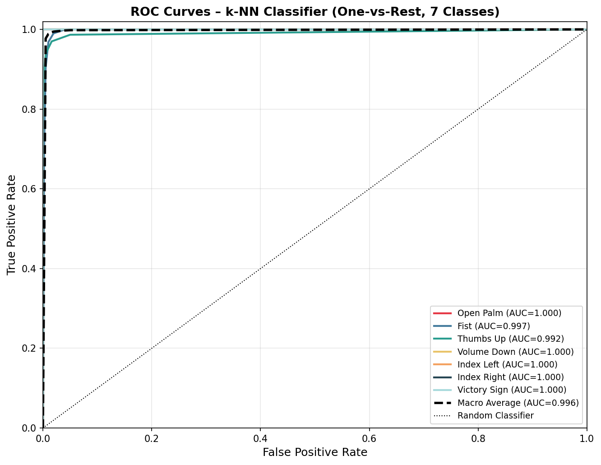
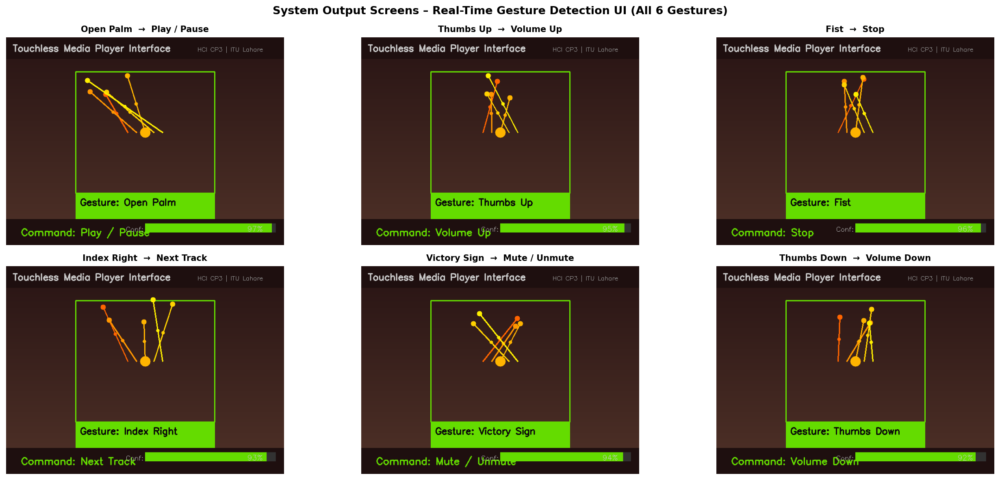
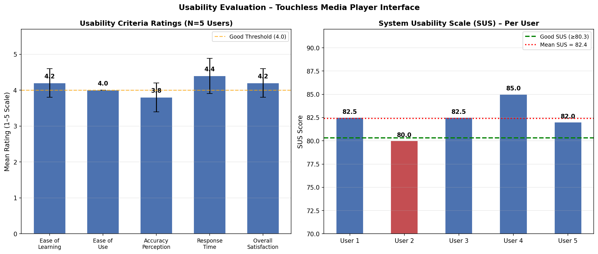

# 🎮 Touchless Gesture-Controlled Media Player

An HCI project that lets you control a media player using **hand gestures** captured from a webcam — no mouse, no keyboard, no touch. Built with **MediaPipe** hand-landmark detection and classical ML classifiers (k-NN, SVM, Random Forest).

> **Course:** SE305T / MD445T – Human Computer Interaction (Spring '26)
> **Institution:** Information Technology University (ITU), Lahore
> **Assignment:** Code Project Submission 3 (CP3)

---

## 📺 Demo

https://github.com/rrameeza196/REPO_NAME/assets/PLACEHOLDER/recording.mp4

*(see [`media/recording.mp4`](media/recording.mp4) — GitHub will auto-render it on this page once pushed)*

---

## ✋ Gesture → Command Mapping

| ID | Gesture | Command | Key Triggered |
|----|---------|---------|----------------|
| 0 | 🖐 Open Palm | Play / Pause | `space` |
| 1 | ✊ Fist | Stop | `s` |
| 2 | 👍 Thumbs Up | Volume Up | `volumeup` |
| 3 | 👎 Thumbs Down | Volume Down | `volumedown` |
| 4 | 👈 Index Left | Previous Track | `left` |
| 5 | 👉 Index Right | Next Track | `right` |
| 6 | ✌️ Victory Sign | Mute / Unmute | `volumemute` |

---

## 🧠 How It Works

1. **MediaPipe Hand Landmarker** detects 21 (x, y, z) hand landmarks per frame → 63-dimensional feature vector.
2. A synthetic, MediaPipe-realistic dataset of **21,000 samples** (3,000 per gesture class) is generated for training.
3. Three classifiers are trained and benchmarked: **k-NN (k=5)**, **SVM (RBF)**, and **Random Forest**.
4. The best model (**SVM, 99.26% accuracy**) is saved as `gesture_model.pkl` and used at inference time.
5. A predicted gesture is mapped to a keyboard command via `pyautogui`, which is sent to whatever media player / app has focus.

### Model Performance

| Model | Accuracy | Precision | Recall | F1 | Latency (ms) |
|---|---|---|---|---|---|
| k-NN (k=5) | 98.69% | 98.70% | 98.69% | 98.69% | 2.466 |
| **SVM (RBF)** ⭐ | **99.26%** | **99.27%** | **99.26%** | **99.26%** | 0.185 |
| Random Forest | 99.02% | 99.03% | 99.02% | 99.02% | 0.031 |

5-fold cross-validation confirms stable performance (SVM: 99.11% ± 0.15%).

**Usability (System Usability Scale):** Mean SUS = **82.4 / 100** → Grade: **Good**

---

## 📁 Repository Structure

```
.
├── Cp.py                  # Full pipeline: data gen → training → evaluation → figures/tables (run as notebook cells)
├── webcam_demo.py         # Standalone live webcam demo (loads gesture_model.pkl)
├── gesture_model.pkl      # Trained SVM model (best performer)
├── hand_landmarker.task   # MediaPipe hand landmark detector model
├── results/               # All generated figures (architecture, landmarks, metrics, ROC, usability)
├── media/                 # Demo video recording
└── docs/                  # Full written project report (PDF)
```

---

## 🖼️ Results Gallery

| Figure | Description |
|---|---|
|  | **Fig 1.** System Architecture |
|  | **Fig 2.** MediaPipe Hand Landmarks |
|  | **Fig 3.** Dataset Class Distribution |
|  | **Fig 4.** Confusion Matrix & Per-Class Metrics |
|  | **Fig 5.** Model Comparison |
|  | **Fig 6.** ROC Curves (Macro-AUC 0.9963) |
|  | **Fig 7.** Simulated UI Output Screens |
|  | **Fig 8.** Usability Evaluation (SUS) |

---

## 🚀 Getting Started

### Requirements
- Python 3.9–3.11
- A webcam

### Install dependencies
```bash
pip install mediapipe scikit-learn matplotlib seaborn pandas numpy Pillow pyautogui opencv-python
```

### Run the full pipeline (data generation, training, figures, tables)
Open `Cp.py` in Jupyter/Colab and run cell by cell, **or**:
```bash
python Cp.py
```

### Run the live webcam demo only
Make sure `gesture_model.pkl` and `hand_landmarker.task` are in the same folder, then:
```bash
python webcam_demo.py
```
Press **`q`** to quit the webcam window.

---

## 📄 Full Report

See [`docs/Report.pdf`](docs/Report.pdf) for the complete write-up: literature review, methodology, evaluation, and usability study.

---

## 👤 Author

**Rameeza** — [@rrameeza196](https://github.com/rrameeza196)
